# StockPredict

## Documento de Análisis y Diseño (DAD)

**Elaborado por:** Pedro Luis Alvarez Gonzalez
**Carné:** 7690 - 22- 5839
**Revisado por:** Melvin Cali
**Institución:** Universidad Mariano Gálvez de Guatemala
**Curso:** Seminario de Tecnologías de Información
**Fecha:** 22/08/2026

## CONTENIDO

**Control de versiones**

**1 Introducción**

**2 Contexto general de la Solución**

- 2.1. Participantes
- 2.2. Flujo Funcional de StockPredict
- 2.3. Alcance
- 2.4. Limitaciones
- 2.5. Cronograma de actividades

**3 Descripción del proceso de solución**

- 3.1. Desarrollo de los requisitos funcionales (RF)
- 3.2. Desarrollo de los requisitos no funcionales (RNF)
- 3.3. Dependencias con otros requerimientos
- 3.4. Descripción de las unidades de programación
  - 3.4.1. CRUD de categorías
  - 3.4.2. CRUD de productos
  - 3.4.3. Registrar venta
  - 3.4.4. Registrar compra
  - 3.4.5. Ajustar stock manual
  - 3.4.6. Cálculo de predicción de stock (fórmula PTS)
- 3.5. Descripción y diagrama del proceso técnico
  - 3.5.1. Diagrama de flujo general del sistema
  - 3.5.2. Diagrama de secuencia: Registrar venta
  - 3.5.3. Diagrama de secuencia: Registrar compra
  - 3.5.4. Diagrama de secuencia: Ajustar stock manual
  - 3.5.5. Diagrama de secuencia: Predicción de compra
- 3.6. Archivos y repositorio

**4 Diseño de la base de datos**

- 4.1. Estructura de tablas
- 4.2. Diagrama entidad - relación

**5 Test**

- 5.1. Unidades de programación
- 5.2. Diagramas de Secuencias

**6 Pruebas**

- 6.1. QA
  - 6.1.1. Casos de Prueba
  - 6.1.2. Pruebas Unitarias

**7 Glosario**

- 7.1. Definición de Términos

**8 Anexos**

- 8.1. Mockups de las pantallas

## Control de versiones

| Fecha | Versión | Autor | Descripción |
|---|---|---|---|
| 21/08/2026 | 1.0 | Pedro Luis Alvarez Gonzalez | Creación del documento |

## 1. Introducción

StockPredict nace de un problema común que vive varios negocios informales de venta en linea, no hay forma de saber con certeza cuánto producto conviene comprar, para tener en stock. Quien lleva el negocio termina comprando "a ojo", basándose nada más en la experiencia o en lo que recuerda que se vendió antes, y eso trae dos problemas constantes: se queda sin stock de productos que sí se venden bien (perdiendo clientas que ya no vuelven) o le sobra producto que no rotó (dinero quieto que no genera ganancia).

En este documento se describe el análisis y diseño de StockPredict, una aplicacion movil pensado para llevar un control simple del catálogo de productos, registrar las ventas semana a semana, y con esa información sugerir cuánto producto se debería comprar en la próxima oleada de compra. La idea no es construir un sistema de inventario completo ni un punto de venta, sino resolver puntualmente ese problema de decisión: cuánto pedir al proveedor para no quedarse corto ni comprar de más.

Este documento sirve como guía técnica del proyecto, detallando el alcance, los requerimientos, el diseño de base de datos y las pruebas planificadas para su desarrollo.

---

## 2. Contexto general de la solución

StockPredict está pensado para un solo tipo de usuario: la persona que administra el negocio. Esta persona ingresa al sistema, gestiona sus categorías y productos, registra cuánto vendió cada semana, y el sistema le devuelve una sugerencia de cuánto comprar para la siguiente semana, basada en el historial de ventas de cada producto.

El sistema no depende de proveedores externos, formas de pago ni servicios de mensajería. Es una solución autocontenida que solo necesita los datos que el propio usuario ingresa.

### 2.1 Participantes

| Iniciales | Nombre y apellido | Rol | Contacto |
|---|---|---|---|
| PLA | Pedro Luis Alvarez | Desarrollador | palvarezg1@miumg.edu.gt |
| MC | Melvin Cali | Revisor / Catedrático | mcalic1@miumg.edu.gt |
| WL | Wendy Lopez | Usuaria de prueba |  |

### 2.2 Flujo funcional de StockPredict

El flujo de uso del sistema sigue una lógica semanal, que es como realmente opera el negocio:

1. La usuaria inicia sesión en el sistema desde su celular.
2. Administra sus categorías y productos (los crea, edita o da de baja según lo que va a vender esa temporada).
3. Durante la semana, registra las ventas de cada producto conforme van ocurriendo. Cada venta descuenta automáticamente del stock disponible.
4. Si llega mercadería nueva de algún proveedor, la registra en el módulo de inventario, lo cual actualiza el stock.
5. Al cierre de la semana, la usuaria consulta la pantalla de predicción de compra, donde el sistema le muestra, producto por producto, cuánto se sugiere comprar para la siguiente venta, calculado según el historial reciente de ventas.
6. Con esa sugerencia, la usuaria decide cuánto pedir a su proveedor.
7. Si un pedido llega mal, se daña o no se logra vender, la usuaria puede ajustar el stock manualmente sin necesidad de pasar por el módulo de compras.

Este ciclo se repite semana tras semana, alimentando cada vez más el historial de ventas y, con eso, mejorando la precisión de la sugerencia.

### 2.3 Alcance

- Registro e inicio de sesión de un único usuario, con opción de recuperación de contraseña.
- Gestión (CRUD) de categorías de producto, incluyendo la asignación de un ícono predefinido por categoría.
- Gestión (CRUD) de productos, asociados a una categoría y con su stock correspondiente.
- Registro de ventas semanales por producto, con descuento automático de stock.
- Registro de entradas de inventario (compras a proveedor) con actualización automática de stock.
- Ajuste manual de stock para casos de entrega fallida o producto no vendido.
- Cálculo de una sugerencia de compra para la siguiente semana, basada en el historial de ventas de cada producto (o de su categoría, si el producto es nuevo), usando la fórmula PTS (Ponderación, Tendencia y Seguridad).
- Diseño responsive, priorizando el uso desde navegador móvil.

### 2.4 Limitaciones

- El sistema no maneja clientas, pedidos individuales ni pagos; su enfoque es exclusivamente el control de producto y la predicción de stock.
- No existe integración con WhatsApp ni con ningún sistema de notificaciones automáticas.
- El sistema es de un solo usuario; no contempla roles, permisos ni manejo multiusuario.
- La predicción de stock se basa en reglas matemáticas simples sobre el historial de ventas; no se implementa ningún modelo de inteligencia artificial ni machine learning.
- No se incluye una calculadora de precio de venta; esta queda planteada como una mejora futura fuera del alcance actual.
- Todo lo no indicado explícitamente en el alcance queda fuera de este proyecto.

## 2.5 Cronograma de actividades

El desarrollo de StockPredict se organiza siguiendo las etapas propias del ciclo de vida del software: análisis, diseño, desarrollo, pruebas e implementación. La fecha límite para tener la aplicación implementada y funcionando es el **31 de octubre**.

### Tabla de actividades

| Etapa | Actividad | Fecha inicio | Fecha fin |
|---|---|---|---|
| Análisis | Definición de requisitos funcionales y no funcionales | 24/08 | 30/08 |
| Análisis | Definición de la fórmula de predicción (PTS) | 24/08 | 30/08 |
| Diseño | Diseño de base de datos y diagrama entidad-relación | 31/08 | 06/09 |
| Diseño | Diseño de mockups y wireframes de las pantallas | 31/08 | 06/09 |
| Desarrollo | Configuración del proyecto (backend, frontend, base de datos) | 07/09 | 13/09 |
| Desarrollo | Módulo de autenticación (registro, login, recuperar contraseña) | 14/09 | 20/09 |
| Desarrollo | Módulo de categorías y productos (CRUD) | 21/09 | 27/09 |
| Desarrollo | Módulo de ventas e inventario (compras y ajuste de stock) | 28/09 | 04/10 |
| Desarrollo | Módulo de predicción de stock (fórmula PTS) | 05/10 | 11/10 |
| Desarrollo | Dashboard y ajustes visuales generales | 12/10 | 18/10 |
| Pruebas | Pruebas unitarias y casos de prueba (QA) | 19/10 | 25/10 |
| Pruebas | Pruebas con la usuaria final | 26/10 | 28/10 |
| Implementación | Corrección de observaciones y despliegue final | 29/10 | 31/10 |

### Diagrama de Gantt

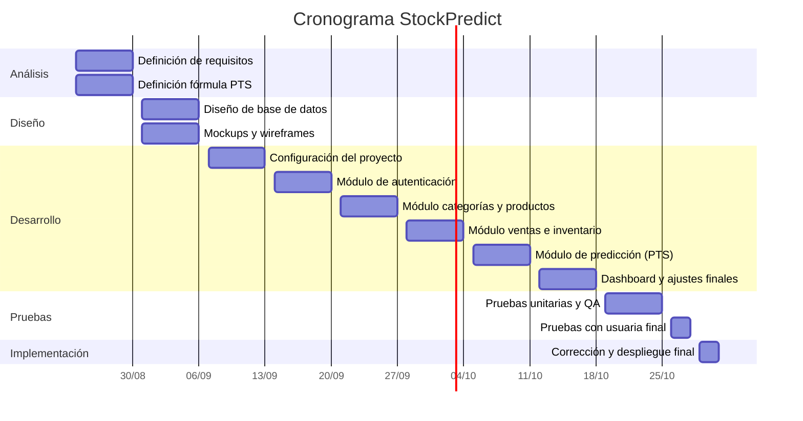

## 3. Descripción del proceso de solución

### 3.1 Requisitos funcionales (RF)

**Módulo de autenticación**

- RF01: El sistema debe permitir a la usuaria registrarse con nombre, correo y contraseña.
- RF02: El sistema debe permitir a la usuaria iniciar sesión con correo y contraseña.
- RF03: El sistema debe permitir recuperar la contraseña, validando primero que el correo ingresado exista como usuario registrado.
- RF04: El sistema debe enviar un enlace al correo de la usuaria para restablecer la contraseña.
- RF05: El sistema debe permitir ingresar y confirmar una nueva contraseña a través del enlace recibido.

**Módulo de categorías**

- RF06: El sistema debe permitir registrar una categoría con nombre e ícono, seleccionado de una lista predefinida.
- RF07: El sistema debe permitir editar el nombre y el ícono de una categoría existente.
- RF08: El sistema debe permitir eliminar o inactivar una categoría.
- RF09: El sistema debe permitir listar todas las categorías registradas por la usuaria.

**Módulo de productos**

- RF10: El sistema debe permitir registrar un producto con nombre, categoría y stock inicial.
- RF11: El sistema debe permitir editar los datos de un producto existente.
- RF12: El sistema debe permitir eliminar o inactivar un producto.
- RF13: El sistema debe permitir listar todos los productos, con la opción de filtrarlos por categoría.
- RF14: El sistema debe mostrar el ícono de la categoría correspondiente junto a cada producto listado.

**Módulo de ventas**

- RF15: El sistema debe permitir registrar la cantidad vendida de un producto durante la semana en curso.
- RF16: El sistema debe guardar automáticamente la fecha de la venta al momento del registro, sin mostrarla ni solicitarla a la usuaria.
- RF17: El sistema debe descontar automáticamente del stock la cantidad vendida.
- RF18: El sistema debe mantener un historial de ventas por producto y por semana.

**Módulo de inventario**

- RF19: El sistema debe permitir registrar la entrada de nueva mercadería (compra a proveedor), actualizando el stock del producto correspondiente.
- RF20: El sistema debe permitir ajustar manualmente el stock de un producto, para casos de entrega fallida o producto no vendido.
- RF21: El sistema debe mostrar el stock actual de cada producto en todo momento.

**Módulo de predicción de compra**

- RF22: El sistema debe calcular, mediante la fórmula PTS, la cantidad de stock sugerida para la siguiente semana, con base en el historial de ventas del producto.
- RF23: Si un producto no cuenta con historial propio suficiente, el sistema debe calcular la sugerencia usando el historial de ventas de su categoría.
- RF24: El sistema debe calcular la cantidad a comprar como la diferencia entre el stock sugerido y el stock actual.
- RF25: Si el stock actual es igual o mayor al sugerido, el sistema debe indicar que no es necesario comprar.
- RF26: El sistema debe mostrar un listado semanal con la sugerencia de compra de cada producto.

**Módulo de panel principal**

- RF27: El sistema debe mostrar en el dashboard un saludo personalizado a la usuaria.
- RF28: El sistema debe mostrar en el dashboard el conteo de productos activos y el conteo de productos con stock bajo.
- RF29: El sistema debe ofrecer en el dashboard accesos rápidos que no dupliquen las opciones del menú de navegación.

---

### 3.2 Requisitos no funcionales (RNF)

- RNF01: El sistema debe tener un diseño responsive, con prioridad de uso desde aplicación móvil.
- RNF02: El tiempo de carga de cada pantalla no debe superar los 2 segundos.
- RNF03: El sistema debe ser de un solo usuario, sin manejo de roles ni permisos.
- RNF04: La lógica de predicción de stock debe basarse en reglas matemáticas simples sobre el historial de ventas (fórmula PTS), sin el uso de inteligencia artificial ni machine learning.
- RNF05: El sistema debe estar disponible durante todo el periodo de pruebas con la usuaria.
- RNF06: El sistema no debe integrar WhatsApp, notificaciones automáticas ni pasarelas de pago.
- RNF07: La interfaz debe ser simple y clara, pensada para una persona sin conocimientos técnicos.
- RNF08: El código y la base de datos deben quedar documentados para facilitar mantenimiento o mejoras futuras.
- RNF09: Las contraseñas de las usuarias deben almacenarse de forma segura, utilizando un mecanismo de cifrado o hash, nunca en texto plano.

---

### 3.3 Dependencias con otros requerimientos

StockPredict es un sistema autocontenido, por lo que no depende de otros componentes, sistemas externos ni equipos de trabajo para funcionar. No existe integración con proveedores, pasarelas de pago, servicios de mensajería ni otros módulos externos al propio sistema.

La única dependencia identificada es de carácter técnico y no funcional: el envío del correo de recuperación de contraseña (RF04).

### 3.4 Descripción de las unidades de programación

A continuación se describen las unidades de programación principales que conforman StockPredict. Cada una representa una función o proceso independiente del sistema.

**Unidad: CRUD de categorías**

- Descripción: permite crear, leer, actualizar y eliminar (inactivar) categorías de producto.
- Entradas: nombre de la categoría, ícono seleccionado de la lista predefinida.
- Salidas: categoría registrada, editada o marcada como inactiva.
- Proceso: la usuaria ingresa el nombre y elige un ícono de una galería fija. El sistema valida que el nombre no esté vacío y que el ícono seleccionado exista dentro de las opciones predefinidas, antes de guardar el registro.

**Unidad: CRUD de productos**

- Descripción: permite crear, leer, actualizar y eliminar (inactivar) productos.
- Entradas: nombre del producto, categoría asociada, stock inicial.
- Salidas: producto registrado, editado o marcado como inactivo.
- Proceso: la usuaria ingresa los datos del producto y selecciona una categoría ya existente. El sistema valida que el nombre no esté vacío, que la categoría exista y que el stock inicial sea un número igual o mayor a cero, antes de guardar el registro.

**Unidad: Registrar venta**

- Descripción: registra la cantidad vendida de un producto durante la semana en curso.
- Entradas: producto seleccionado, cantidad vendida.
- Salidas: venta registrada, stock actualizado.
- Proceso: la usuaria selecciona el producto y digita la cantidad vendida. El sistema valida que la cantidad sea mayor a cero y que no supere el stock disponible. Al guardar, se descuenta automáticamente la cantidad del stock del producto y se almacena la fecha del sistema como fecha de la venta, sin mostrarla a la usuaria.

**Unidad: Registrar compra**

- Descripción: registra la entrada de nueva mercadería comprada a un proveedor.
- Entradas: producto seleccionado, cantidad comprada.
- Salidas: stock actualizado.
- Proceso: la usuaria selecciona el producto y digita la cantidad comprada. El sistema valida que la cantidad sea mayor a cero. Al guardar, se suma automáticamente la cantidad al stock actual del producto.

**Unidad: Ajustar stock manual**

- Descripción: permite corregir el stock de un producto sin pasar por una venta o una compra.
- Entradas: producto seleccionado, nuevo valor de stock.
- Salidas: stock actualizado.
- Proceso: la usuaria selecciona el producto y digita el nuevo valor de stock. El sistema valida que el valor sea un número igual o mayor a cero y reemplaza directamente el stock actual por el nuevo valor ingresado.

**Unidad: Cálculo de predicción de stock (fórmula PTS)**

- Descripción: calcula la cantidad de stock sugerida y la cantidad a comprar para la siguiente semana, con base en el historial de ventas.
- Entradas: historial de ventas de las últimas tres semanas del producto (o de su categoría, si el producto es nuevo), stock actual.
- Salidas: stock sugerido, cantidad a comprar (o mensaje de "no es necesario comprar").
- Proceso: el sistema obtiene las ventas de las últimas tres semanas, calcula el promedio ponderado, ajusta el resultado según el factor de tendencia, aplica el margen de seguridad, y finalmente resta el stock actual para obtener la cantidad a comprar. Este cálculo se detalla en el apartado de la fórmula PTS documentado previamente en el proyecto.

---

### 3.5 Descripción y diagrama del proceso técnico

El proceso técnico de StockPredict sigue una arquitectura web simple, donde el navegador de la usuaria se comunica con el backend del sistema, y este a su vez con la base de datos.

**Descripción general del proceso:**

1. La usuaria accede desde el navegador de su celular a la aplicación web.
2. El backend valida la sesión de la usuaria antes de permitir el acceso a cualquier módulo.
3. Cada acción (crear categoría, crear producto, registrar venta, registrar compra, ajustar stock) se envía del frontend al backend mediante una petición HTTP.
4. El backend valida los datos recibidos y ejecuta la operación correspondiente contra la base de datos.
5. Para el módulo de predicción, el backend consulta el historial de ventas almacenado, aplica la fórmula PTS y devuelve el resultado calculado al frontend.
6. El frontend muestra el resultado a la usuaria en la pantalla correspondiente.

**Diagrama de flujo general del sistema:**

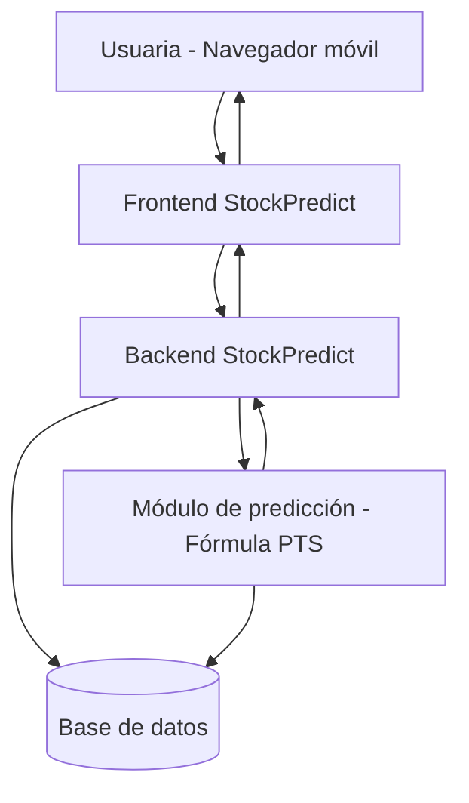

**Diagrama de secuencia: Registrar venta**

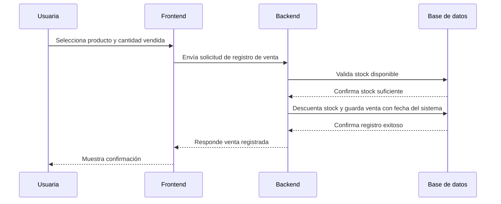

**Diagrama de secuencia: Predicción de compra**

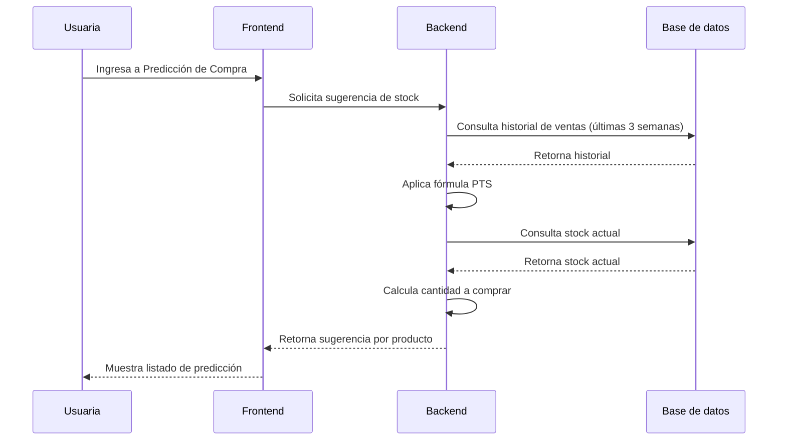

---

### 3.6 Archivos y repositorio

El código fuente de StockPredict, así como la documentación técnica del proyecto, se encuentra alojado en un repositorio de control de versiones en GitHub, donde se lleva el historial de cambios del desarrollo.

- Repositorio del proyecto: https://github.com/PLAlvarez11/StockPredict.git
- Estructura general del repositorio:
  - `/frontend`: código de la interfaz web.
  - `/backend`: lógica del servidor, endpoints y cálculo de la fórmula PTS.
  - `/database`: scripts de creación de la base de datos.
  - `/docs`: documentación del proyecto (DAD, mockups, wireframes).

## 4. Diseño de la base de datos

### 4.1 Estructura de tablas

La base de datos de StockPredict se diseñó de forma sencilla, pensada para un solo usuario que administra sus propias categorías y productos. La relación de pertenencia se maneja a nivel de usuario: un usuario puede tener muchas categorías y muchos productos, pero cada categoría y cada producto pertenecen únicamente a un usuario. Las ventas y los movimientos de inventario no necesitan guardar directamente el usuario, ya que se obtienen a través del producto al que pertenecen.

**Tabla: usuario**

| Campo | Tipo | Restricción | Descripción |
|---|---|---|---|
| id | INT | PK, autoincremental | Identificador único del usuario |
| nombre | VARCHAR(100) | NOT NULL | Nombre de la usuaria |
| correo | VARCHAR(150) | NOT NULL, UNIQUE | Correo utilizado para iniciar sesión |
| contraseña | VARCHAR(255) | NOT NULL | Contraseña almacenada con hash |
| fecha_creacion | DATETIME | NOT NULL | Fecha de registro del usuario |

**Tabla: categoria**

| Campo | Tipo | Restricción | Descripción |
|---|---|---|---|
| id | INT | PK, autoincremental | Identificador único de la categoría |
| nombre | VARCHAR(100) | NOT NULL | Nombre de la categoría |
| icono | VARCHAR(50) | NOT NULL | Identificador del ícono predefinido asignado |
| usuario_id | INT | FK → usuario.id, NOT NULL | Usuario dueño de la categoría |
| estado | BOOLEAN | NOT NULL, default true | Indica si la categoría está activa o inactiva |

**Tabla: producto**

| Campo | Tipo | Restricción | Descripción |
|---|---|---|---|
| id | INT | PK, autoincremental | Identificador único del producto |
| nombre | VARCHAR(150) | NOT NULL | Nombre del producto |
| categoria_id | INT | FK → categoria.id, NOT NULL | Categoría a la que pertenece el producto |
| usuario_id | INT | FK → usuario.id, NOT NULL | Usuario dueño del producto |
| stock | INT | NOT NULL, default 0 | Cantidad de stock actual disponible |
| estado | BOOLEAN | NOT NULL, default true | Indica si el producto está activo o inactivo |

**Tabla: venta**

| Campo | Tipo | Restricción | Descripción |
|---|---|---|---|
| id | INT | PK, autoincremental | Identificador único de la venta |
| producto_id | INT | FK → producto.id, NOT NULL | Producto vendido |
| cantidad | INT | NOT NULL | Cantidad vendida |
| fecha | DATETIME | NOT NULL | Fecha en la que se registró la venta (asignada automáticamente por el sistema) |

**Tabla: movimiento_inventario**

Esta tabla agrupa tanto las entradas de compra a proveedor como los ajustes manuales de stock, diferenciándolos mediante el campo `tipo`. Se optó por unificarlos en una sola tabla en lugar de crear dos tablas separadas, ya que ambos procesos representan lo mismo a nivel de datos: un cambio en el stock de un producto, y solo cambia el origen del movimiento.

| Campo | Tipo | Restricción | Descripción |
|---|---|---|---|
| id | INT | PK, autoincremental | Identificador único del movimiento |
| producto_id | INT | FK → producto.id, NOT NULL | Producto afectado |
| tipo | ENUM('compra', 'ajuste') | NOT NULL | Tipo de movimiento registrado |
| cantidad | INT | NOT NULL | Cantidad comprada, o nuevo valor de stock en caso de ajuste |
| fecha | DATETIME | NOT NULL | Fecha en la que se registró el movimiento |

---

### 4.2 Diagrama entidad-relación

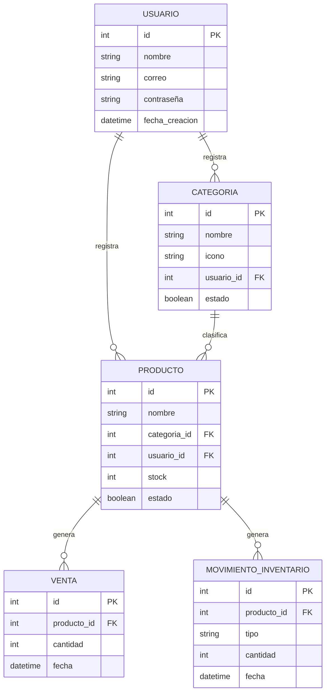

**Relaciones:**

- Un usuario puede registrar muchas categorías, pero cada categoría pertenece a un único usuario.
- Un usuario puede registrar muchos productos, pero cada producto pertenece a un único usuario.
- Una categoría puede clasificar muchos productos, pero cada producto pertenece a una única categoría.
- Un producto puede tener muchas ventas registradas a lo largo del tiempo.
- Un producto puede tener muchos movimientos de inventario (compras o ajustes) registrados a lo largo del tiempo.

## 5. Test

### 5.1 Unidades de programación

Las unidades de programación sujetas a pruebas son las mismas descritas en el apartado 3.4, ya que representan los procesos centrales del sistema:

- CRUD de categorías
- CRUD de productos
- Registrar venta
- Registrar compra
- Ajustar stock manual
- Cálculo de predicción de stock (fórmula PTS)

Cada una de estas unidades se prueba de forma individual antes de integrarse al flujo completo del sistema, verificando que reciban los datos correctos, que validen entradas inválidas, y que devuelvan el resultado esperado.

### 5.2 Diagramas de secuencia

**Diagrama de secuencia: Registrar compra**

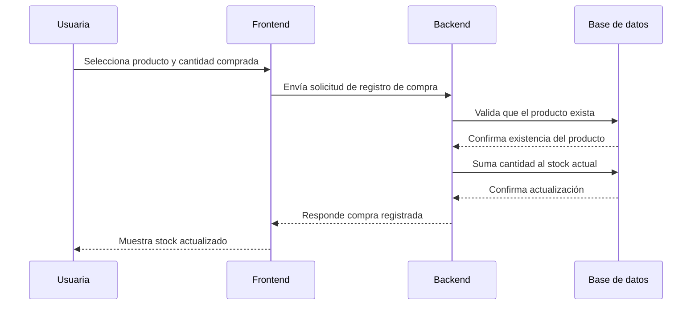

**Diagrama de secuencia: Ajustar stock manual**

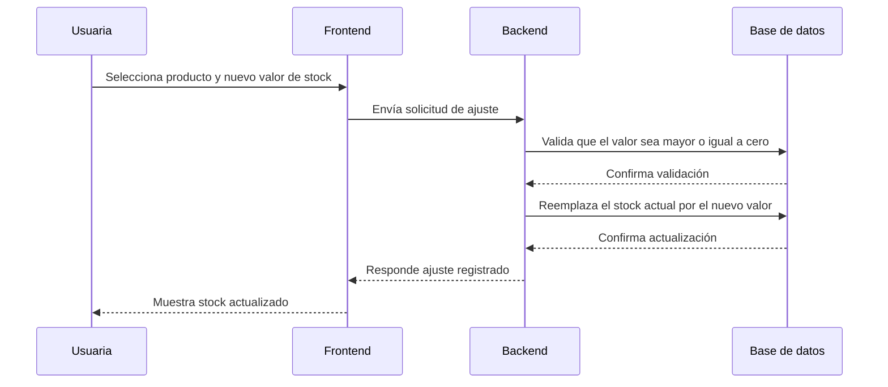

---

## 6. Pruebas

### 6.1 QA

#### 6.1.1 Casos de prueba

**CRUD de categorías**

| ID | Tipo | Descripción |
|---|---|---|
| C01 | Satisfactorio | Crear una categoría con nombre válido e ícono seleccionado |
| C02 | Satisfactorio| Editar el nombre de una categoría existente |
| C03 | Satisfactorio| Editar el ícono de una categoría existente |
| C04 | Satisfactorio| Inactivar una categoría existente |
| C05 | Satisfactorio | Listar todas las categorías activas del usuario |
| C06 | Insatisfactorio| Crear una categoría sin nombre |
| C07 | Insatisfactorio| Crear una categoría sin seleccionar ícono |

**CRUD de productos**

| ID | Tipo | Descripción |
|---|---|---|
| P01 | Satisfactorio | Crear un producto con nombre, categoría y stock inicial válidos |
| P02 | Satisfactorio | Editar el nombre de un producto existente |
| P03 | Satisfactorio | Editar la categoría de un producto existente |
| P04 | Satisfactorio| Inactivar un producto existente |
| P05 | Satisfactorio | Listar productos filtrados por categoría |
| P06 | Insatisfactorio| Crear un producto sin nombre |
| P07 | Insatisfactorio| Crear un producto sin categoría asignada |
| P08 | Insatisfactorio| Crear un producto con stock inicial negativo |

**Registrar venta**

| ID | Tipo | Descripción |
|---|---|---|
| V01 | Satisfactorio| Registrar una venta con cantidad menor o igual al stock disponible |
| V02 | Satisfactorio| Verificar que el stock se descuenta automáticamente tras la venta |
| V03 | Satisfactorio| Verificar que la fecha se guarda automáticamente sin mostrarse a la usuaria |
| V04 | Insatisfactorio| Registrar una venta con cantidad mayor al stock disponible |
| V05 | Insatisfactorio | Registrar una venta con cantidad igual a cero |
| V06 | Insatisfactorio | Registrar una venta sin seleccionar producto |

**Registrar compra**

| ID | Tipo | Descripción |
|---|---|---|
| CO01 | Satisfactorio| Registrar una compra con cantidad válida |
| CO02 | Satisfactorio| Verificar que el stock se incrementa automáticamente tras la compra |
| CO03 | Insatisfactorio| Registrar una compra con cantidad igual a cero |
| CO04 | Insatisfactorio | Registrar una compra sin seleccionar producto |

**Ajustar stock manual**

| ID | Tipo | Descripción |
|---|---|---|
| A01 | Satisfactorio| Ajustar el stock de un producto a un valor válido mayor o igual a cero |
| A02 | Satisfactorio| Verificar que el stock anterior se reemplaza correctamente por el nuevo valor |
| A03 | Insatisfactorio | Ajustar el stock a un valor negativo |
| A04 | Insatisfactorio| Ajustar el stock sin seleccionar producto |

**Cálculo de predicción de stock (fórmula PTS)**

| ID | Tipo | Descripción |
|---|---|---|
| PR01 | Satisfactorio| Calcular la sugerencia de stock para un producto con historial de 3 semanas |
| PR02 | Satisfactorio | Calcular la sugerencia de stock para un producto nuevo, usando el historial de su categoría |
| PR03 | Satisfactorio| Calcular correctamente la cantidad a comprar cuando el stock sugerido es mayor al stock actual |
| PR04 | Satisfactorio | Mostrar el mensaje "No es necesario comprar" cuando el stock actual es igual o mayor al sugerido |
| PR05 | Insatisfactorio| Calcular la sugerencia para un producto sin ningún historial de ventas ni de su categoría |

**Autenticación**

| ID | Tipo | Descripción |
|---|---|---|
| AU01 | Satisfactorio| Registrar un nuevo usuario con datos válidos |
| AU02 | Satisfactorio| Iniciar sesión con correo y contraseña correctos |
| AU03 | Satisfactorio | Solicitar recuperación de contraseña con un correo existente |
| AU04 | Satisfactorio| Restablecer la contraseña correctamente desde el enlace recibido |
| AU05 | Insatisfactorio | Iniciar sesión con contraseña incorrecta |
| AU06 | Insatisfactorio| Solicitar recuperación de contraseña con un correo que no existe |
| AU07 | Insatisfactorio| Registrar un usuario con un correo ya registrado |

#### 6.1.2 Pruebas unitarias

Las pruebas unitarias se enfocan en validar de forma aislada la lógica de cada unidad de programación, especialmente el cálculo de la fórmula PTS, por ser el componente diferenciador del sistema:

- Prueba del cálculo del promedio ponderado con distintos valores de venta.
- Prueba del cálculo del factor de tendencia, verificando el ajuste al alza y a la baja.
- Prueba de la aplicación del margen de seguridad sobre el stock ajustado.
- Prueba del cálculo final de la cantidad a comprar, incluyendo el caso donde el resultado es igual o menor a cero.
- Prueba de las validaciones de entrada en los módulos de venta, compra y ajuste de stock (cantidades negativas, campos vacíos, producto inexistente).

Estas pruebas se ejecutan antes de las pruebas de integración, con el objetivo de detectar errores de lógica en las primeras etapas del desarrollo.

## 7. Glosario

### 7.1 Definición de términos

| N° | Concepto | Definición |
|---|---|---|
| 1 | CRUD | Acrónimo de Crear, Leer, Actualizar y Eliminar (Create, Read, Update, Delete); operaciones básicas para administrar datos en un sistema |
| 2 | Stock | Cantidad de unidades disponibles de un producto en un momento determinado |
| 3 | Oleada | Cada ciclo semanal de venta de producto dentro del negocio, tras el cual se evalúa qué comprar para la siguiente semana |
| 4 | Fórmula PTS | Fórmula propia del sistema (Ponderación, Tendencia y Seguridad) utilizada para calcular la sugerencia de stock a comprar |
| 5 | Promedio ponderado | Cálculo que asigna mayor peso a los valores más recientes dentro de un conjunto de datos, en este caso, las ventas de las últimas semanas |
| 6 | Factor de tendencia | Valor que indica si las ventas de un producto están subiendo, bajando o manteniéndose estables |
| 7 | Margen de seguridad | Porcentaje adicional aplicado al cálculo de stock sugerido, para reducir el riesgo de quedarse sin producto |
| 8 | Responsive | Característica de una interfaz web que se adapta correctamente a distintos tamaños de pantalla, en especial dispositivos móviles |
| 9 | Backend | Parte del sistema encargada de la lógica del servidor, validaciones y comunicación con la base de datos |
| 10 | Frontend | Parte del sistema con la que interactúa directamente la usuaria, es decir, la interfaz visual |
| 11 | Diagrama entidad-relación | Representación gráfica de las tablas de una base de datos y las relaciones que existen entre ellas |

---

## 8. Anexos

### 8.1 Mockups de las pantallas

A continuación se presentan los mockups del sistema StockPredict, correspondientes a las pantallas de Login, Registro, Recuperar contraseña, Restablecer contraseña, Dashboard, Categorías, Productos, Registrar venta, Inventario y Predicción de compra.

**Login**

**Registro**

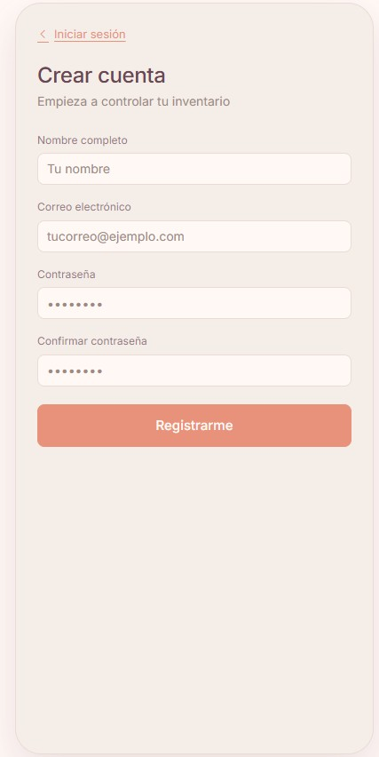

**Recuperar contraseña**

**Restablecer contraseña**

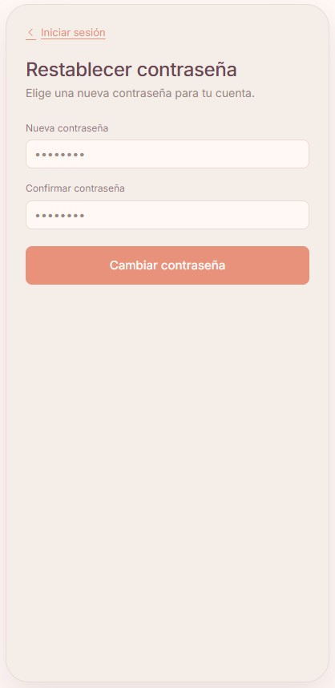

**Dashboard**

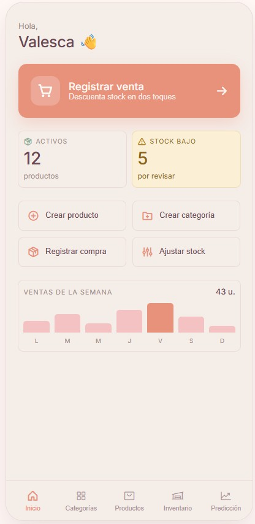

**Categorías**

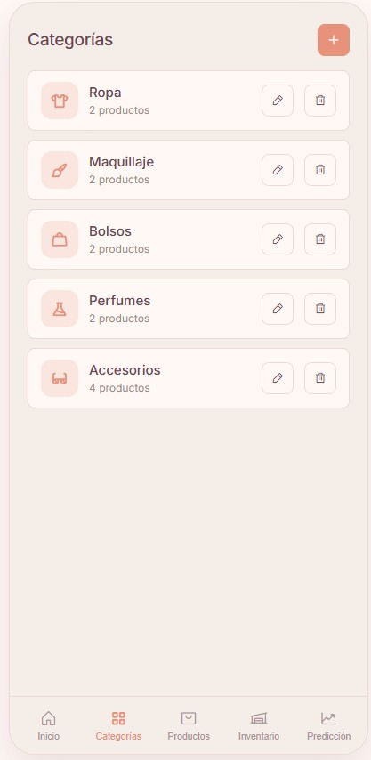

**Productos**

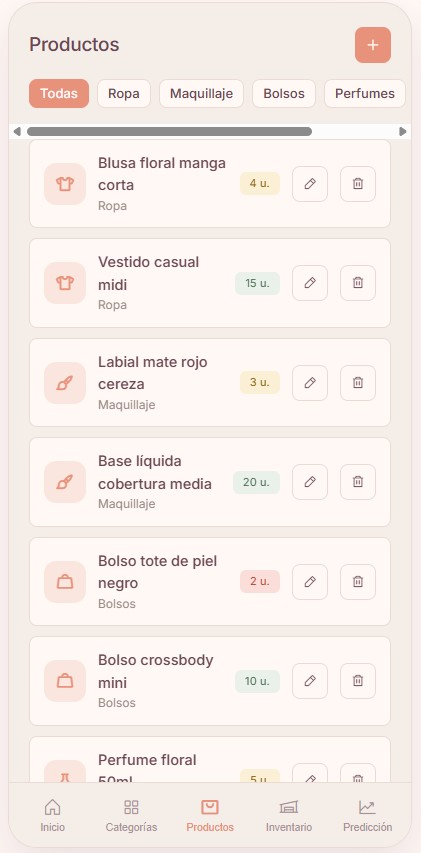

**Registrar venta**

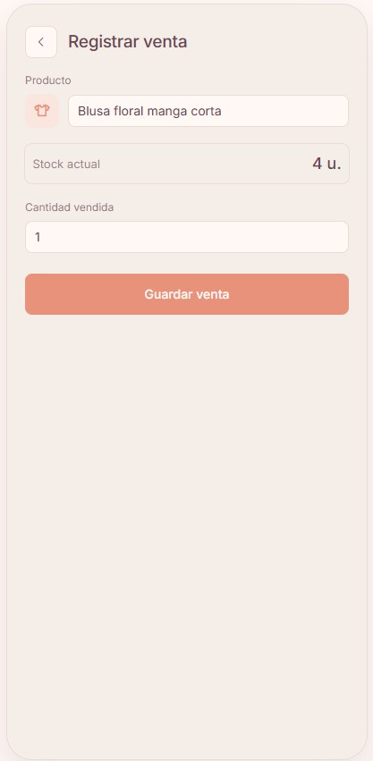

**Inventario**

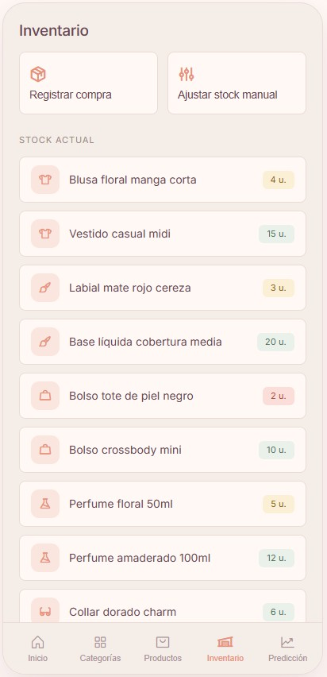

**Predicción de compra**

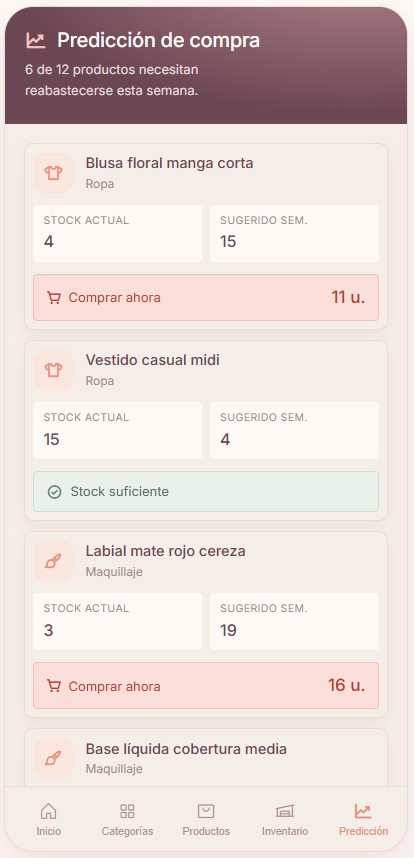

